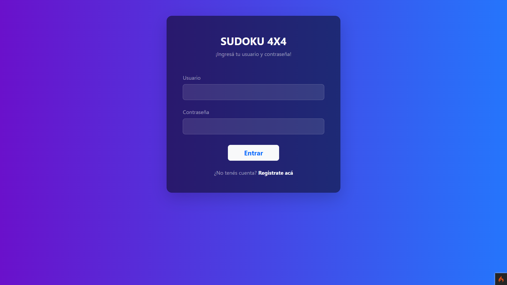
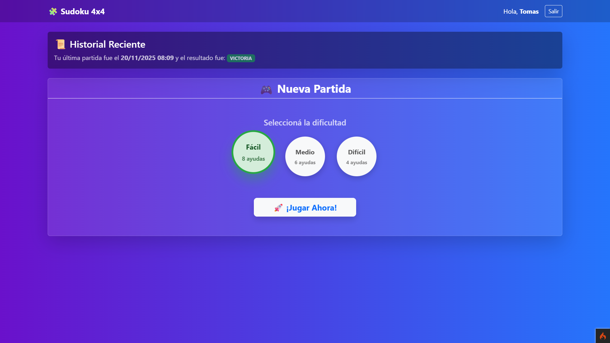
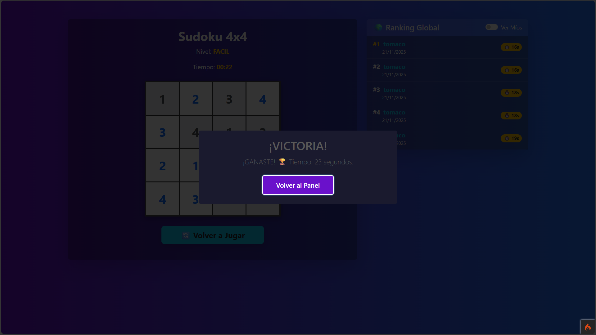

# Sudoku 4x4 - Examen Final (LDPL)


> **Alumno:** Da silva Tomás
> **Materia:** Laboratorio de Programación y Lenguajes
> **Año:** 2025

Este repositorio contiene la entrega final de la materia: una aplicación web completa para jugar al **Sudoku (4x4)**. El sistema cuenta con autenticación de usuarios, niveles de dificultad, generación algorítmica de tableros con solución única y una interfaz moderna.

---

## Características Principales

El proyecto implementa lógica avanzada y buenas prácticas de ingeniería de software:

* **Seguridad:** Sistema de Login y Registro completo con encriptación de contraseñas y validaciones de usuario/email únicos.
* **Backend:** Desarrollado en **CodeIgniter 4**.
* **Frontend:** Diseño responsivo con **Bootstrap 5**, alertas animadas con **SweetAlert2** y validaciones asíncronas con JS/AJAX.

---

## Requisitos del Sistema

Para ejecutar la aplicación localmente, es necesario contar con:

* **XAMPP:** Para el servidor Apache y la base de datos MySQL.
* **Composer:** Gestor de dependencias de PHP.
* **Git:** (Opcional) Para clonar el repositorio.
* **Navegador Web.

---

## Guía de Instalación y Configuración

Sigue estos pasos detallados para configurar el entorno correctamente.

### 1. Configuración de XAMPP (Crítico)

**Habilitar extensión `intl` (Obligatorio para CI4):**
1.  Abrí el panel de XAMPP.
2.  En Apache, clic en `Config` > `PHP (php.ini)`.
3.  Buscá la línea `;extension=intl`.
4.  Borrá el punto y coma (`;`) inicial para descomentarla. Debe quedar: `extension=intl`.
5.  Guardá y reiniciá Apache.

**Configuración del Puerto MySQL (Si usas el puerto 3007):**
*Si tu instalación usa el puerto estándar 3306, omití esto. Si seguiste la configuración del laboratorio (3007):*
1.  En XAMPP > MySQL > `Config` > `my.ini`. Cambiá `port=3306` por `port=3007`.
2.  En `C:\xampp\phpMyAdmin\config.inc.php`, agregá la línea: `$cfg['Servers'][$i]['port'] = '3007';`.

### 2. Instalación del Proyecto

**Clonar y Dependencias:**
1.  Descargá o cloná el proyecto en `C:\xampp\htdocs\`.
2.  Abrí una terminal en la carpeta del proyecto (`/sudoku`).
3.  Ejecutá:
    ```bash
    composer install
    composer update
    ```
    *Esto descargará las librerías del framework necesarias para arrancar*.

**Base de Datos:**
1.  Entrá a phpMyAdmin: `http://localhost/phpmyadmin`.
2.  Creá una base de datos llamada **`sudoku_db`**.
3.  Importá el archivo `.sql` incluido en la carpeta `database/` del proyecto.

**Variables de Entorno (.env):**
1.  En la raíz del proyecto, duplicá el archivo `env` y renombralo a `.env`.
2.  Configurá las credenciales de tu base de datos:

```ini
CI_ENVIRONMENT = development

database.default.hostname = localhost
database.default.database = sudoku_db
database.default.username = root
database.default.password = 
database.default.DBDriver = MySQLi
database.default.port = 3007  # O 3306 según tu XAMPP
```

### 3. Ejecutar (Vía XAMPP)
1. Abrí el **Panel de Control de XAMPP**.
2. Iniciá los módulos **Apache** y **MySQL** (Botones "Start").
3. Abrí tu navegador y accedé a la siguiente ruta:

    http://localhost/Sudoku_ExamenFinal_LDPL/sudoku/public/

---

## Estructura del Sitio

| Página | Descripción Funcional |
| :--- | :--- |
| **Login** | Inicio de sesión seguro. Redirección automática si ya existe sesión. |
| **Registro** | Alta de usuario con validación de unicidad (email/user). |
| **Panel** | Selección de dificultad (Fácil, Medio, Difícil) y acceso al juego. |
| **Tablero** | Grilla de juego 4x4, Cronómetro y Rankings en tiempo real. |

---
## Cómo Jugar

**Niveles de Dificultad:**
* **Fácil:** 8 pistas iniciales.
* **Medio:** 6 pistas iniciales.
* **Difícil:** 4 pistas iniciales.

**Reglas:**
Para ganar, rellená los huecos del 1 al 4 sin repetir números en:
1.  La misma **Fila**.
2.  La misma **Columna**.
3.  El mismo **Cuadrante** (bloque 2x2).

Al finalizar, presioná **"Verificar Solución"**. Si ganás, tu tiempo se guardará en el ranking.

---

## Capturas

### Login y Panel Principal
 

### Gameplay (Niveles)
 

### Victoria

